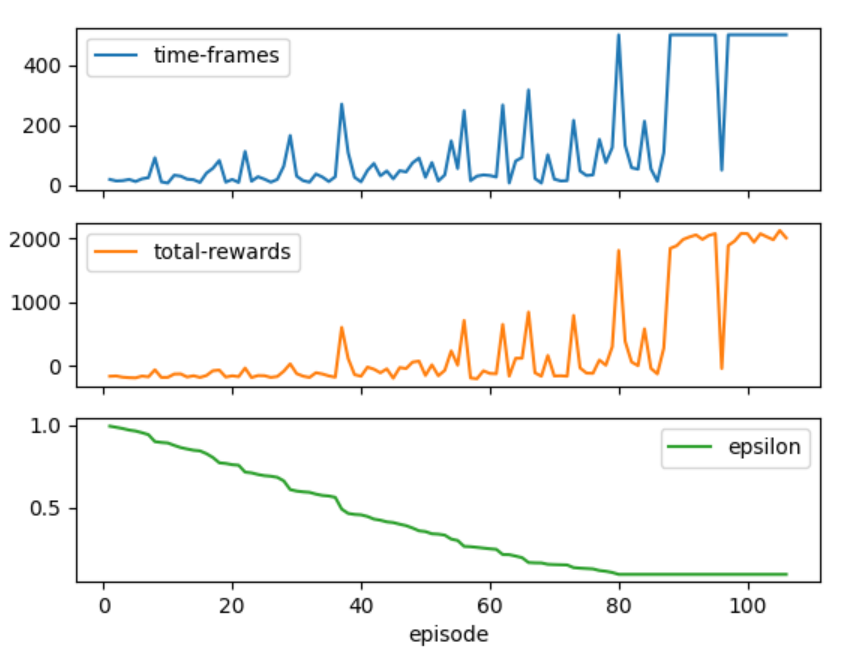
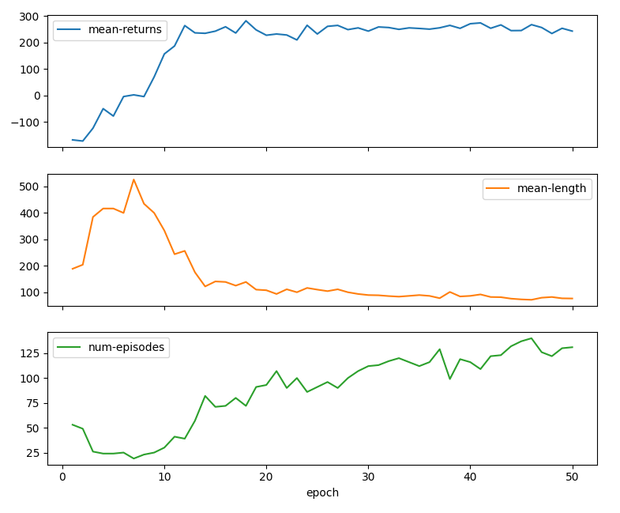
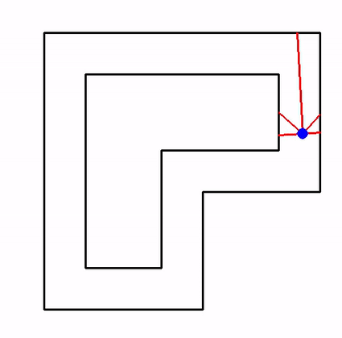
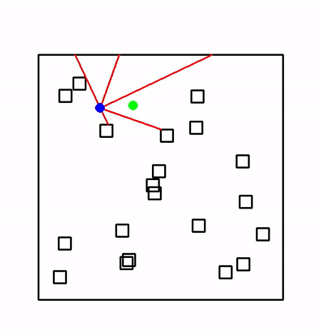

# DRL-based-navigation
A project for the autonomous navigation of agents in simulated environments using Deep Reinforcement Learning.

## Abstract
Obstacle detection and avoidance, as well as path planning, are key concepts and prerequisites for applications of self-navigated objects or robots without any human guidance. This project tries to solve the problem of safe autonomous navigation of an agent in a simulation environment using Deep Reinforcement Learning (DRL) methods.

Two separate simulation environments were used, each representing a navigation problem of a different nature and difficulty. One environment concerns the problem of navigating a closed circular path in the form of a circuit (circuit-type navigation), while the second environment concerns the navigation of the object towards a specific destination point while avoiding obstacles (goal type navigation).

Models based on DRL algorithms DQN and PPO were developed, trained and their respective performances were measured, evaluated and compared with each other in a testing process. Also, for both algorithms, there were experiments done concerning the reward function of each environment and the influence of special reward-changing factors for specific preferred states was tested.

## Methodology
The project is based on the use of OpenAI gym (https://github.com/openai/gym) and its API's approach in facilitating the development and experimentation with DRL algorithms in various simulated environments.

The simulation environments that were used in this project are the two environments of the gym-navigation package by Nick Geramanis (https://github.com/NickGeramanis/gym-navigation).

For each environment, which refers to a different task for the auto-navigated agent, two models were developed using Python, Tensorflow and Keras, trained and evaluated for a series of episodes. One using the DQN algorithm and one using PPO.

## Example training results

#### DQN Navigation Track

#### PPO Navigation Goal

## Resulting autonomous navigation of trained models

#### DQN Navigation Track trained model at 95 episodes:

#### PPO Navigation Goal trained model at 30 epochs:

## References
Code development sources of inspiration and references:
- https://www.tensorflow.org/api_docs/python/tf/keras
- https://keras.io/api/
- https://github.com/QaziYahya/Openai-Taxi-Solution-using-Reinforcement-Learning
- https://github.com/andywu0913/OpenAI-GYM-CarRacing-DQN
- https://towardsdatascience.com/deep-q-learning-for-the-cartpole-44d761085c2f

- https://keras.io/examples/rl/ppo_cartpole/
- https://spinningup.openai.com/en/latest/algorithms/ppo.html
- https://github.com/openai/spinningup/blob/master/spinup/algos/tf1/ppo/ppo.py
